# Decision Tree Hyperparameter Tuning

## Project Overview

This project studies the effect of different Decision Tree hyperparameters on classification performance using the Breast Cancer Wisconsin Dataset from Scikit-Learn.

The objective was to identify the combination of hyperparameters that provides the best balance between model accuracy and generalization using:

- Train/Test Split
- 5-Fold Cross Validation
- Accuracy
- Log Loss

---

# Dataset Overview

### Dataset Head

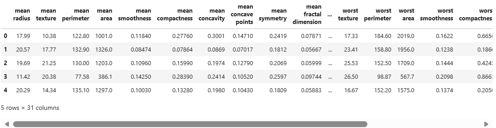

### Dataset Shape and Information

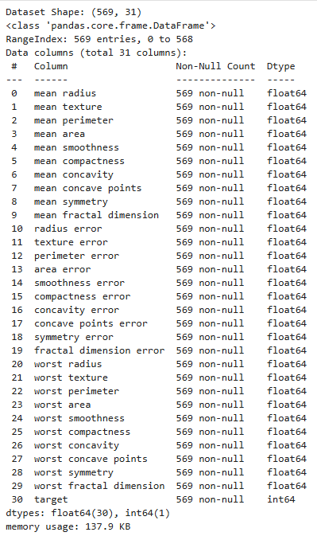

### Dataset Description

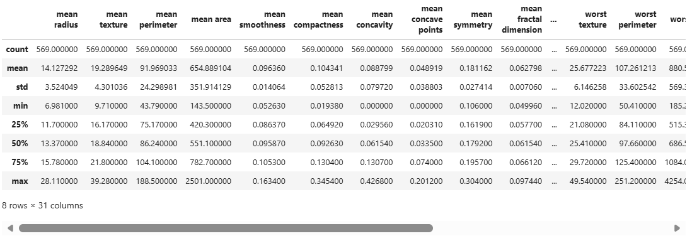

---

# Baseline Model

A default Decision Tree Classifier was trained to establish a reference point for all subsequent experiments.

### Baseline Parameters

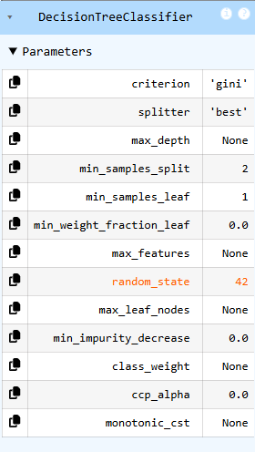

### Baseline Tree

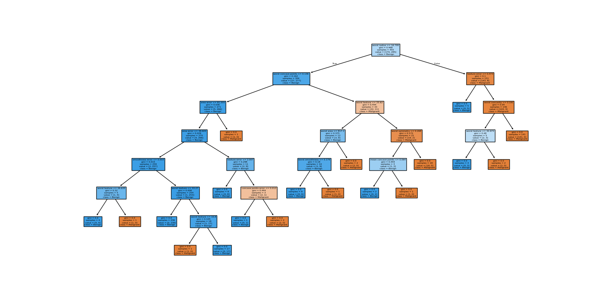

---

# Hyperparameter Studies

Each hyperparameter was varied independently while all others remained unchanged.

---

## 1. Criterion

### Accuracy

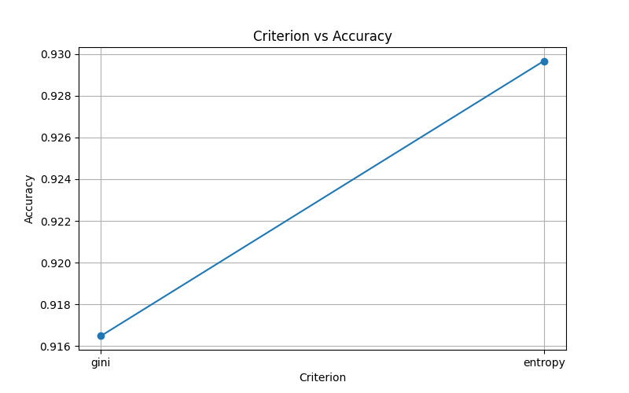

### Log Loss

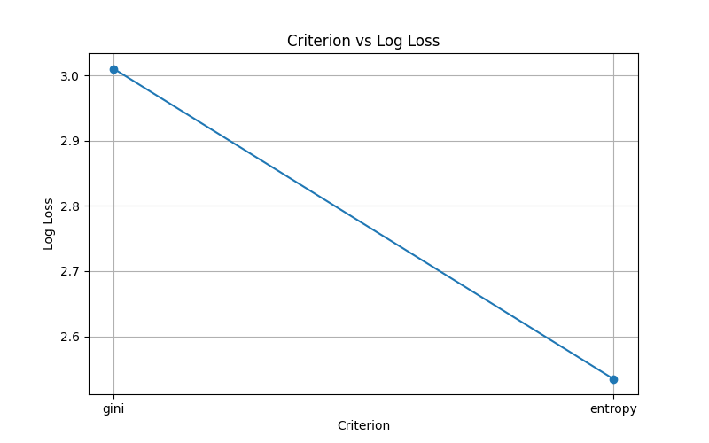

**Observation:**  
The study compares Gini and Entropy criteria to determine which splitting strategy produces better predictive performance.

---

## 2. Maximum Depth

### Accuracy

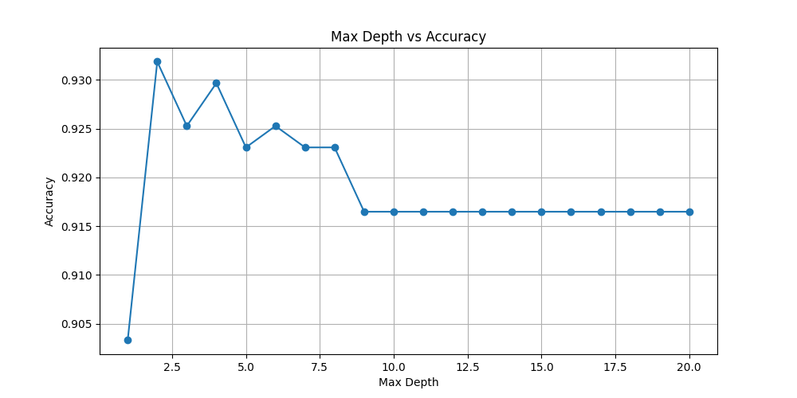

### Log Loss

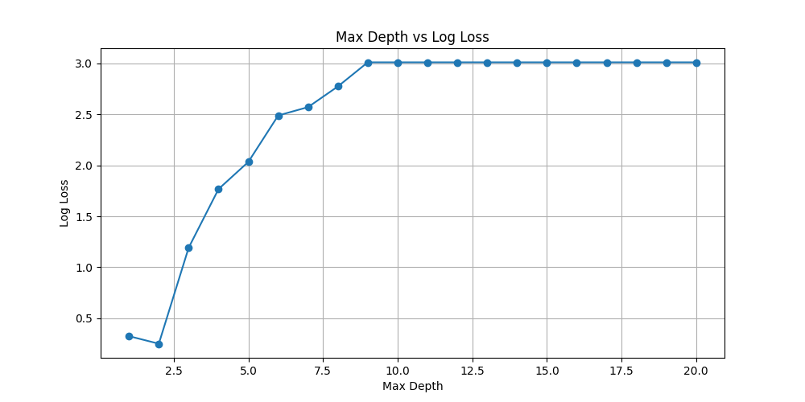

**Observation:**  
Tree depth strongly influences underfitting and overfitting behaviour.

---

## 3. Maximum Leaf Nodes

### Accuracy

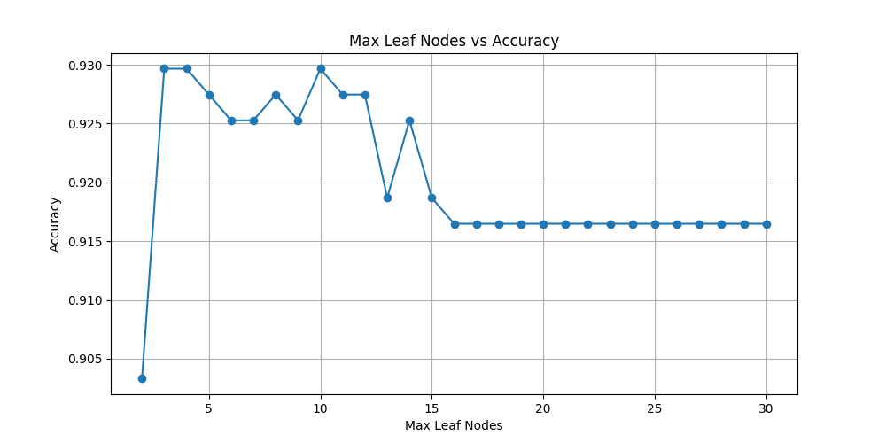

### Log Loss

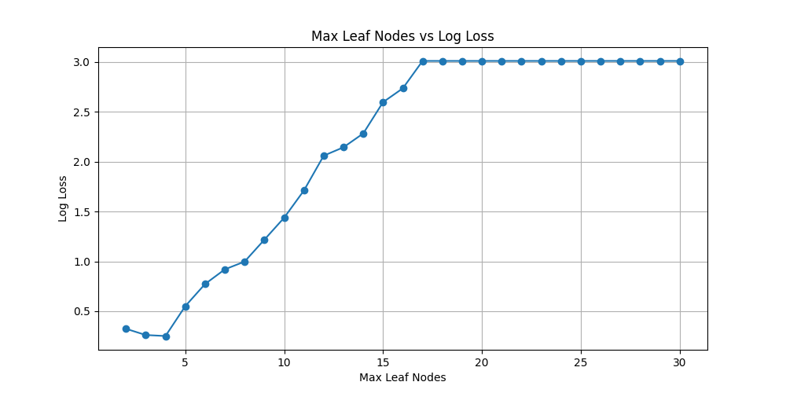

**Observation:**  
Restricting the number of leaf nodes reduces model complexity and can improve generalization.

---

## 4. Minimum Samples Split

### Accuracy

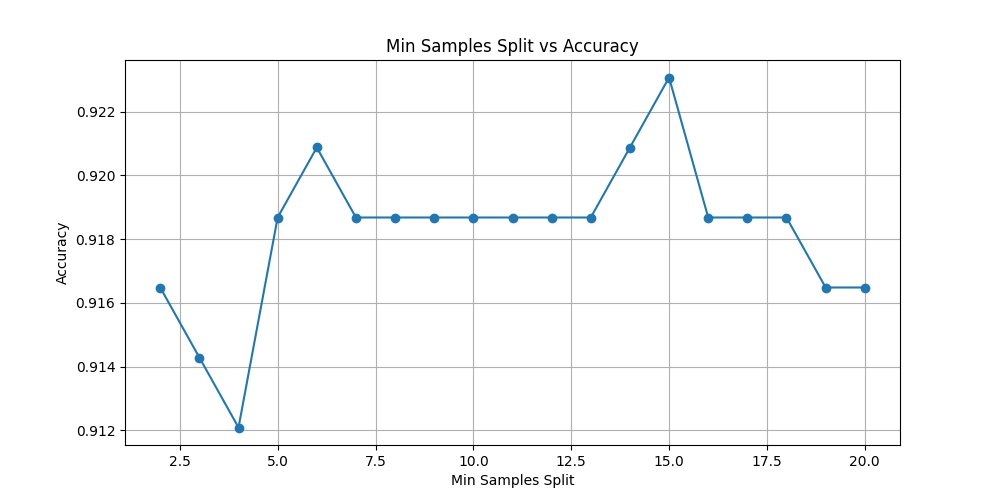

### Log Loss

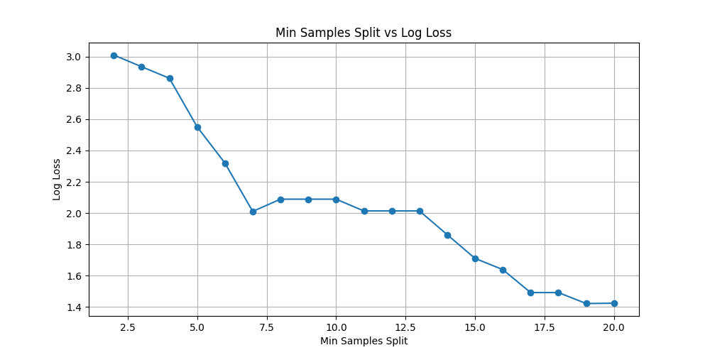

**Observation:**  
Changing the minimum samples required for a split affects how aggressively the tree grows.

---

## 5. Minimum Samples Leaf

### Accuracy

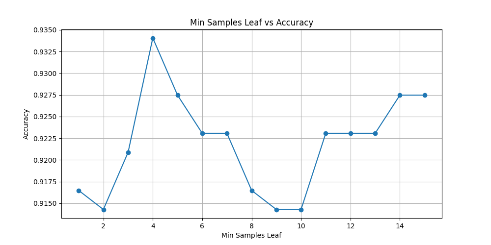

### Log Loss

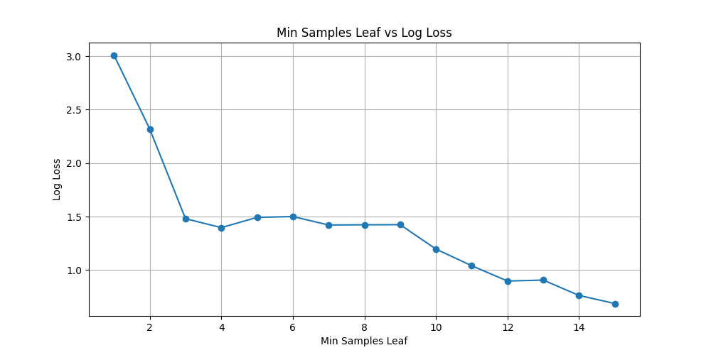

**Observation:**  
Larger leaf sizes create smoother and less complex decision boundaries.

---

## 6. CCP Alpha (Cost Complexity Pruning)

### Accuracy

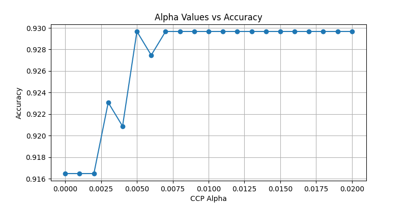

### Log Loss

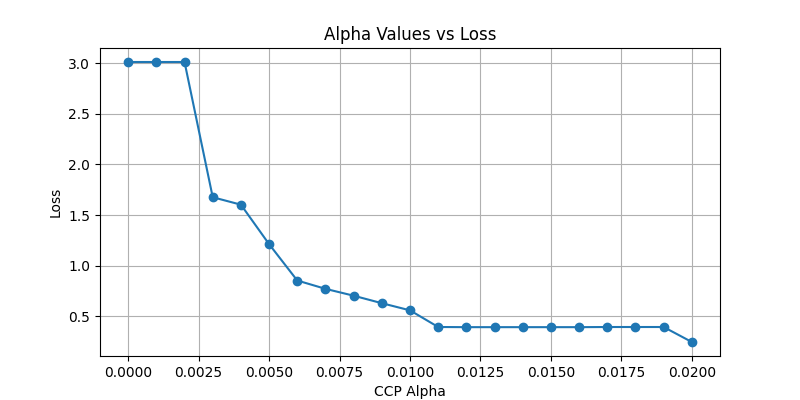

**Observation:**  
Pruning helps remove unnecessary branches and improve model generalization.

---

# Hyperparameter Summary

The best-performing value from each tuning experiment was collected and used to construct the final model.

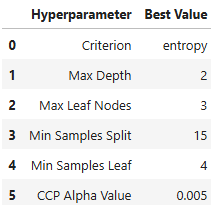

---

# Final Tuned Model

The optimal hyperparameters obtained from the individual studies were combined to create the final Decision Tree model.

### Tuned Tree

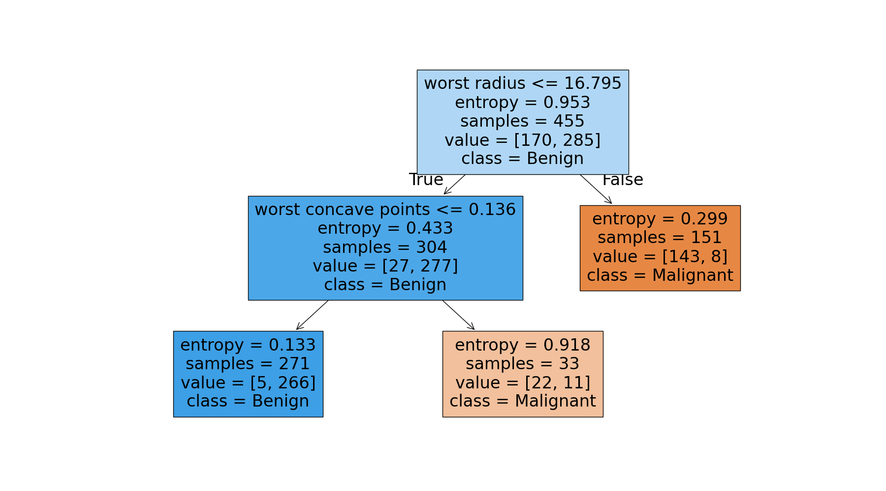

---

# Model Comparison

### Performance Comparison

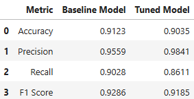

### Confusion Matrices

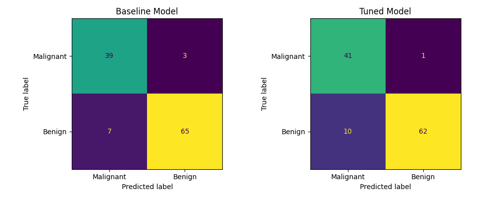

---

# Conclusion

- Hyperparameter tuning improved model performance over the baseline Decision Tree.
- Cross-validation helped identify robust parameter values.
- Pruning and complexity-control parameters contributed significantly to better generalization.
- The final tuned model achieved stronger overall classification performance while maintaining interpretability.

---